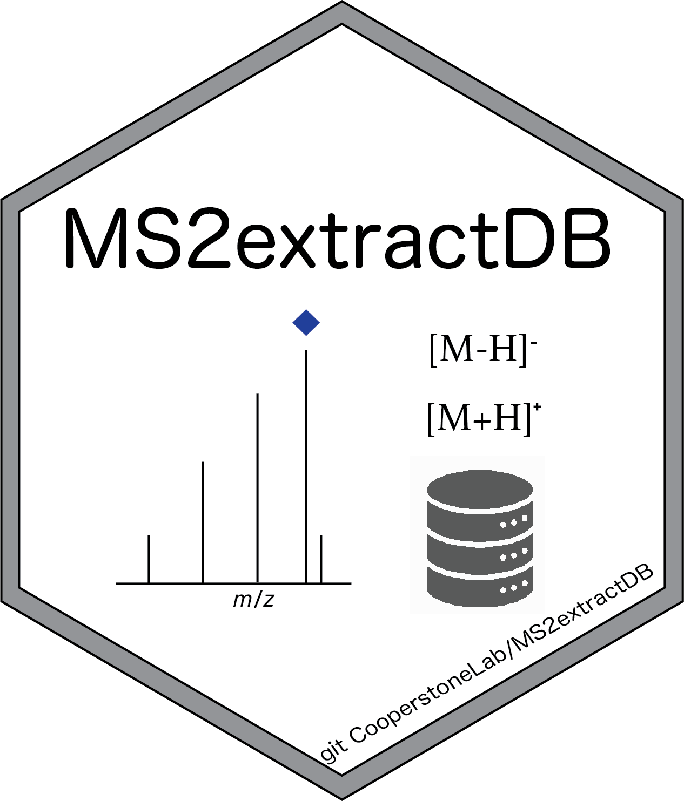

<!-- README.md is generated from README.Rmd. Please edit that file -->

```{r, include = FALSE}
knitr::opts_chunk$set(
  collapse = TRUE,
  comment = "#>",
  fig.path = "man/figures/README-",
  out.width = "100%"
)
```



# MS2extractDB

<!-- badges: start -->

<!-- badges: end -->

The goal of MS2extractDB is to stored the MS/MS data of a set of
authentic small molecules standards, including, phenolic acids,
flavonoids, dihydrochalcones, carbohydrates. Standards were collected
using an Agilent QTOF 6545 and 6546, in negative and positive
polarities, and 20 and 60 eV (CE). Standards that were collected using
the 6546 QTOF also contains MS/MS at 60 and 80 eV (CE). The raw MS/MS
files will be used jointly with the
[MS2extract](https://cooperstonelab.github.io/MS2extract/) package to
create in-house MS/MS libaries.

## Installation

You can install the development version of MS2extractDB from
[GitHub](https://github.com/CooperstoneLab/MS2extractDB) with:

``` r
# install.packages("devtools")
devtools::install_github("CooperstoneLab/MS2extractDB")
```

## Database description

This package is intended to archive the raw mzml files of authentic
standards, as well as structurated data frames used in
[MS2extract](https://cooperstonelab.github.io/MS2extract/) to automate
the process of creating an in-house MS/MS library

This database contains majorly phenolics compounds, aimed to decipher
the rosacea metabolome. However, as phenolics are expressed in a wide
range of organisms, this database can be used in multiples scenarios.

We grouped the total database in two batches. The two batches are based
on the instrument that was used to acquire the data. For the first
batch, we used an Agilent QTOF 6545, and for the second batch, we used
an Agilent QTOF 6546. In both batches, we collected targeted MS/MS,
using the chromatographic method reported in [Bilbrey at al.
(2022)](https://nph.onlinelibrary.wiley.com/doi/full/10.1111/nph.17693).
In both batches, we collected data in negative and positive polarities,
and we used 20 and 40 eV (CE) using CID. Furthermore, in the second
batch, we also collected data at 60 and 80 eV (CE). The following table
describe what you expect to find in this database.

> Disclaimer: Metabolites with no reported data file has not MS/MS data

###  First Batch (Agilent QTOF 6545)

* Positive polarity at 20 eV [(Read file)](https://github.com/CooperstoneLab/MS2extractDB/blob/main/inst/extdata/batch_read_pos20_6545.csv) 
* Positive polarity at 40 eV [(Read file)](https://github.com/CooperstoneLab/MS2extractDB/blob/main/inst/extdata/batch_read_neg40_6545.csv) 

* Negative polarity at 20 eV [(Read file)](https://github.com/CooperstoneLab/MS2extractDB/blob/main/inst/extdata/batch_read_neg20.csv) 
* Negative polarity at 40 eV [(Read file)](https://github.com/CooperstoneLab/MS2extractDB/blob/main/inst/extdata/batch_read_neg40.csv) 

###  Second Batch (Agilent QTOF 6546)

* Negative polarity at 20 eV
* Negative polarity at 40 eV
* Negative polarity at 60 eV
* Negative polarity at 80 eV

Positive polarity data collection in progress


## List of metabolites

In the `extdata` directory, you will find all the mzml files for all standards.

In the following table, you can see the list of metabolites we are including
in this version of the database.


```{r echo=FALSE, message=FALSE, warning=FALSE}

batchRead_Neg20 <- read.csv("inst/extdata/batch_read_neg20.csv")

batchRead_Neg20 <- dplyr::select(batchRead_Neg20, -File, -Ionization_mode)
batchRead_Neg20
```


 To retrieve the entire table, please use:
 
```
library(MS2extractDB)
data("read_neg20_6545", package = "MS2extractDB")
print(read_neg20_6545)
```
