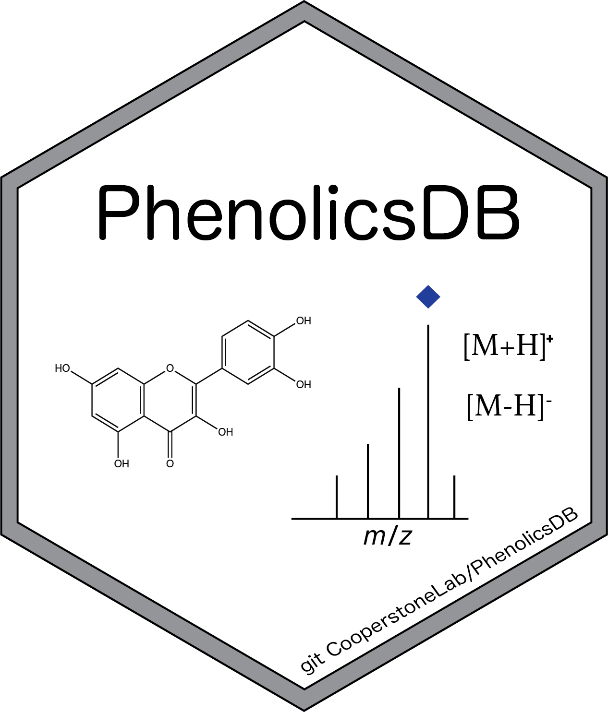

<!-- README.md is generated from README.Rmd. Please edit that file -->



# PhenolicsDB

<!-- badges: start -->
<!-- badges: end -->

`PhenolicsDB` is data package that contains raw MS/MS data of authentic
standards. `PhenolicsDB` raw data files and datasets are aimed to
exemplify the use of
[MS2extract](https://cooperstonelab.github.io/MS2extract/) to create
in-house metabolite MS/MS libraries. Between the list of metabolites we
include phenolic acids, flavonoids, dihydrochalcones, carbohydrates, and
others. Tandem mass spectrometry data was collected using a LC coupled
with a Q-TOF mas analyzer.

## Installation

You can install the development version of PhenolicsDB from
[GitHub](https://github.com/CooperstoneLab/PhenolicsDB) with:

``` r
# install.packages("devtools")
devtools::install_github("CooperstoneLab/PhenolicsDB")
library("PhenolicsDB")
```

## Database description

This package is intended to archive the raw mzml files of authentic
standards, as well as structured data frame aimed to be used jointly
with [MS2extract](https://cooperstonelab.github.io/MS2extract/), to
automate the process of creating in-house MS/MS libraries.

This database contains majorly phenolics compounds, aimed to decipher
and annotate the *Rosacea* metabolome. However, as phenolics are
expressed in a wide range of organisms, this database can be used in
multiples scenarios.

We grouped the total database in two batches. The batches are based on
the instrument we used to acquire the MS/MS data. For the first batch,
we used an Agilent QTOF *6545*, and for the second batch, we used an
Agilent QTOF *6546*. In both batches, we collected targeted MS/MS using
the chromatographic method reported in [Bilbrey at al.
(2022)](https://nph.onlinelibrary.wiley.com/doi/full/10.1111/nph.17693).
We collected data in negative and positive polarity, and we used 20 and
40 eV (CE) using collision induced dissociation (CID). Additionally, in
the second batch, we also collected data at 60 and 80 eV (CE). The
following table describe what you expect to find in this database.

### First Batch (Agilent QTOF 6545)

| Polarity | Collision Energy (eV) | read_dt table             | metadata table             |
|----------|-----------------------|---------------------------|----------------------------|
| Positive | 20                    | `data("read_pos20_6545")` | `data("metdt_pos20_6545")` |
| Positive | 40                    | `data("read_pos40_6545")` | `data("metdt_pos40_6545")` |
| Negative | 20                    | `data("read_neg20_6545")` | `data("metdt_neg20_6545")` |
| Negative | 40                    | `data("read_neg40_6545")` | `data("metdt_neg40_6545")` |

### Second Batch (Agilent QTOF 6546)

| Polarity | Collision Energy (eV) | read_dt table               | metadata table             |
|----------|-----------------------|-----------------------------|----------------------------|
| Positive | 20                    | `data("read_pos20_6546")`   | `data("metdt_pos20_6546")` |
| Positive | 40                    | `data("read_pos40_6546")`   | `data("metdt_pos40_6546")` |
| Positive | 60                    | `data("read_pos6080_6546")` | `data("metdt_pos60_6546")` |
| Positive | 80                    | `data("read_pos6080_6546")` | `data("metdt_pos80_6546")` |
| Negative | 20                    | `data("read_neg20_6546")`   | `data("metdt_neg20_6546")` |
| Negative | 40                    | `data("read_neg40_6546")`   | `data("metdt_neg40_6546")` |
| Negative | 60                    | `data("read_neg60_6546")`   | `data("metdt_neg60_6546")` |
| Negative | 80                    | `data("read_neg80_6546")`   | `data("metdt_neg80_6546")` |

## List of metabolites

In the `extdata` directory you will find all the `.mzml` files for all
standards, as well as the structure tables to be used jointly with
[MS2extract](https://cooperstonelab.github.io/MS2extract/).

In the following table you can see the list of metabolites we are
including in this version of the database, as well as in what batch you
will find them.

> Disclaimer: Metabolites with no reported data file have not MS/MS data

    #>                            Name   Formula min_rt max_rt         Batch
    #> 1                Procyanidin A2 C30H24O12    163    180 (1) QTOF-6545
    #> 2                         Rutin C27H30O16    162    171 (1) QTOF-6545
    #> 3         3-Hydroxybenzaldehyde    C7H6O2    152    166 (1) QTOF-6545
    #> 4         4-Hydroxybenzaldehyde    C7H6O2    137    170 (1) QTOF-6545
    #> 5                Salycilic acid    C7H6O3    180    200 (1) QTOF-6545
    #> 6              (E)-Cinamic acid    C9H8O2    214    228 (1) QTOF-6545
    #> 7     2-3-Dihydroxybenzoic acid    C7H6O4    135    146 (1) QTOF-6545
    #> 8     2-5-Dihydroxybenzoic acid    C7H6O4    120    140 (1) QTOF-6545
    #> 9     2-6-Dihydroxybenzoic acid    C7H6O4    120    150 (1) QTOF-6545
    #> 10    3-4-Dihydroxybenzoic acid    C7H6O4     95    115 (1) QTOF-6545
    #> 11 2,4,6-Trihydroxybenzaldehyde    C7H6O4    150    165 (1) QTOF-6545
    #> 12             Vanillyl alcohol   C8H11O3    110    130 (1) QTOF-6545
    #> 13              p-Coumaric acid    C9H8O3    156    170 (1) QTOF-6545
    #> 14                Vanillyl acid    C8H8O4    136    145 (1) QTOF-6545
    #> 15                  Gallic acid    C7H6O5     60     80 (1) QTOF-6545
    #> 16                 Caffeic acid    C9H8O4    136    146 (1) QTOF-6545
    #> 17                Ascorbic acid    C6H8O6     14     26 (1) QTOF-6545
    #> 18                      Glucose   C6H12O6     15     27 (1) QTOF-6545
    #> 19                   D-Sorbitol   C6H14O6     15     27 (1) QTOF-6545
    #> 20                  Quinic acid   C7H12O6     16     27 (1) QTOF-6545
    #> 21                Ferrulic acid  C10H10O4    167    177 (1) QTOF-6545
    #> 22                 Sinapic acid  C11H12O5    169    180 (1) QTOF-6545
    #> 23                   Naringenin  C15H12O5    175    191 (1) QTOF-6545
    #> 24                    Phloretin  C15H14O5    226    246 (1) QTOF-6545
    #> 25                  Kaempferol   C15H10O6    235    250 (1) QTOF-6545
    #> 26                      Fisetin  C15H10O6    192    202 (1) QTOF-6545
    #> 27              (-)-Epicatechin  C15H14O6    135    150 (1) QTOF-6545
    #> 28                     Catechin  C15H14O6    125    140 (1) QTOF-6545
    #> 29                  Kaempferide  C16H12O6    286    300 (1) QTOF-6545
    #> 30                 Ellagic acid   C14H6O8    165    180 (1) QTOF-6545
    #> 31                   Herbacetin  C15H10O7    203    220 (1) QTOF-6545
    #> 32                 Isorhamnetin  C16H12O7    237    255 (1) QTOF-6545
    #> 33                      Sucrose C12H22O11     15     35 (1) QTOF-6545
    #> 34             Chlorogenic acid  C16H18O9    125    145 (1) QTOF-6545
    #> 35                   Trilobatin C21H24O10    195    207 (1) QTOF-6545
    #> 36                   Phloridzin C21H24O10    185    197 (1) QTOF-6545
    #> 37                   Astragalin C21H20O11    173    190 (1) QTOF-6545
    #> 38                   Quercitrin C21H20O11    175    190 (1) QTOF-6545
    #> 39                    Quercetin  C15H10O7    209    230 (1) QTOF-6545
    #> 40                 Ursolic acid  C30H48O3    428    440 (1) QTOF-6545
    #> 41        Quercetin-3-glucoside C21H21O11    167    180 (1) QTOF-6545
    #> 42                Isoquercitrin C21H20O12    167    180 (1) QTOF-6545
    #> 43      Quercetin-3-galactoside C21H20O12    167    180 (1) QTOF-6545
    #> 44                Corsolic acid  C30H48O4    367    375 (1) QTOF-6545
    #> 45    Quercetin-3-O-glucoronide C21H18O13    165    180 (1) QTOF-6545
    #> 46                   Melezitose C18H32O16     15     33 (1) QTOF-6545
    #> 47               Procyanidin B1 C30H26O12    105    130 (1) QTOF-6545
    #> 48               Procyanidin B2 C30H26O12    133    145 (1) QTOF-6545
    #> 49               Procyanidin B3 C30H26O12    114    135 (1) QTOF-6545
    #> 50                  Procyanidin C30H26O13    150    170 (1) QTOF-6545
    #> 51                     Naringin C27H23O14    175    190 (1) QTOF-6545
    #> 52                  Nictoflorin C27H30O15    170    185 (1) QTOF-6545
    #> 53                   Eriocitrin C27H32O15    157    175 (1) QTOF-6545
    #> 54                Neoeriocitrin C27H32O15    162    175 (1) QTOF-6545
    #> 55                    Narcissin C28H32O16    174    186 (1) QTOF-6545
    #> 56    Quercetin 3-O-sophoroside C27H30O17    149    160 (1) QTOF-6545
    #> 57               Procyanidin C1 C45H38O18    140    152 (1) QTOF-6545
    #> 58        D-(-)-Citramalic Acid    C5H8O5     45     60 (2) QTOF-6546
    #> 59                    Esculetin    C9H6O4    139    146 (2) QTOF-6546
    #> 60                Isoscopoletin   C10H8O4    165    170 (2) QTOF-6546
    #> 61                   Scopoletin   C10H8O4    170    176 (2) QTOF-6546
    #> 62                     Apigenin  C15H10O5    233    240 (2) QTOF-6546
    #> 63                  Tamarixetin   C16H12O    240    250 (2) QTOF-6546
    #> 64         3-O-methyl Quercetin  C16H12O7    219    228 (2) QTOF-6546
    #> 65             Chlorogenic Acid  C16H18O9    131    136 (2) QTOF-6546
    #> 66       Cryptochlorogenic Acid  C16H18O9    133    138 (2) QTOF-6546
    #> 67          Neochlorogenic acid  C16H18O9    114    126 (2) QTOF-6546
    #> 68                  Guaijaverin C20H18O11    173    185 (2) QTOF-6546
    #> 69                   Avicularin C20H18O11    175    182 (2) QTOF-6546
    #> 70       Cyanidin 3-Galactoside C21H21O11    120    135 (2) QTOF-6546
    #> 71    Eriodictyol 7-O-glucoside C21H22O11    166    172 (2) QTOF-6546
    #> 72             Isoquercitroside C21H20O12    167    173 (2) QTOF-6546
    #> 73                    Saponarin C27H30O15    148    154 (2) QTOF-6546

# Citing `PhenolicsDB`

To cite `PhenolicsDB` in your publications, please use:

``` r
## Citation info
citation("PhenolicsDB")
#> To cite PhenolicsDB in publications use:
#> 
#>   Quiroz-Moreno C, Cooperstone J (2023). _PhenolicsDB: phenolics MS/MS
#>   (LC-ESI-QTOF) database repository_.
#>   <https://cooperstonelab.github.io/PhenolicsDB/>.
#> 
#> A BibTeX entry for LaTeX users is
#> 
#>   @Manual{,
#>     title = {PhenolicsDB: phenolics MS/MS (LC-ESI-QTOF) database repository},
#>     author = {Cristian Quiroz-Moreno and Jessica Cooperstone},
#>     year = {2023},
#>     url = {https://cooperstonelab.github.io/PhenolicsDB/},
#>   }
```
