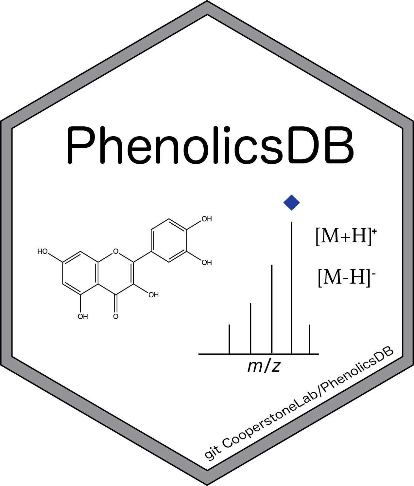

<!-- README.md is generated from README.Rmd. Please edit that file -->



# PhenolicsDB

<!-- badges: start -->

<!-- Zenodo badge -->

[](https://zenodo.org/badge/latestdoi/676239711)

<!-- badges: end -->

`PhenolicsDB` is a data package that contains raw MS/MS data of
authentic analytical standards. `PhenolicsDB` raw data files and data
frames are aimed to exemplify the use of
[MS2extract](https://cooperstonelab.github.io/MS2extract/) to create
in-house metabolite MS/MS libraries. Between the list of metabolites we
include phenolic acids, flavonoids, dihydrochalcones, carbohydrates, and
others. Tandem mass spectrometry data was collected using a LC coupled
to a Q-TOF mass analyzer.

## Download PhenolicsDB

You can download PhenolicsDB in these links:

-   Negative polarity
    [(link)](https://github.com/CooperstoneLab/PhenolicsDB/blob/main/inst/extdata/PhenolicsDB/msp/PhenolicsDB_neg.msp)

-   Positive polarity
    [(link)](https://github.com/CooperstoneLab/PhenolicsDB/blob/main/inst/extdata/PhenolicsDB/msp/PhenolicsDB_pos.msp)

> You can also access the .mzML files used for this library in the
> following
> [link](https://github.com/CooperstoneLab/PhenolicsDB/tree/main/inst/extdata/mzML)

## Database description

This package is intended to archive the raw `.mzML` files of authentic
analytical standards, as well as structured data frames aimed to be used
jointly with [MS2extract](https://cooperstonelab.github.io/MS2extract/),
to automate the process of creating in-house MS/MS libraries.

This database contains majorly phenolics compounds, aimed to decipher
and annotate the *Rosacea* metabolome. However, as phenolics are
expressed in a wide range of organisms, this database can be used in
multiple scenarios.

We grouped the total database in two batches. The batches are based on
the instrument we used to acquire the MS/MS data. For the first batch,
we used an Agilent QTOF *6545*, and for the second batch, we used an
Agilent QTOF *6546*. In both batches, we collected targeted MS/MS using
the chromatographic method reported in [Bilbrey at al.
(2022)](https://nph.onlinelibrary.wiley.com/doi/full/10.1111/nph.17693).
We collected data in negative and positive polarity, and we used 20 and
40 eV (CE) using collision induced dissociation (CID). Additionally, in
the second batch, we also collected data at 60 and 80 eV (CE). The
following tables describe the set of data frames that you can load and
use with [MS2extract](https://cooperstonelab.github.io/MS2extract/).

## List of metabolites

In the `extdata` directory you will find all the `.mzML` files for all
standards, as well as the structure tables to be used jointly with
[MS2extract](https://cooperstonelab.github.io/MS2extract/).

In the following table you can see the list of metabolites we are
including in this version of the database, as well as in what batch you
will find them.

> MS/MS spectra included in this library can be viewed
> [here](https://github.com/CooperstoneLab/PhenolicsDB/tree/main/inst/extdata/extra_doc/spectra_visualizer_ignore.md)

| Name | Formula | Ionization_mode | rt (min) | Collision Energy | Monoisotopic_mass |
|:-----------|:-----------|:-----------|-----------:|:-----------|-----------:|
| 2,3-Dihydroxybenzoic acid | C7H6O4 | Negative | 2.342 | 20 eV, 40 eV | 154.0266 |
| 2,3-Dihydroxybenzoic acid | C7H6O4 | Positive | 2.342 | 20 eV, 40 eV | 154.0266 |
| 2,4,6-Trihydroxybenzaldehyde | C7H6O4 | Negative | 2.625 | 20 eV, 40 eV | 154.0266 |
| 2,4,6-Trihydroxybenzaldehyde | C7H6O4 | Positive | 2.625 | 20 eV, 40 eV | 154.0266 |
| 2,5-Dihydroxybenzoic acid | C7H6O4 | Negative | 2.167 | 20 eV, 40 eV | 154.0266 |
| 2,5-Dihydroxybenzoic acid | C7H6O4 | Positive | 2.167 | 20 eV, 40 eV | 154.0266 |
| 2,6-Dihydroxybenzoic acid | C7H6O4 | Negative | 2.250 | 20 eV, 40 eV | 154.0266 |
| 2,6-Dihydroxybenzoic acid | C7H6O4 | Positive | 2.250 | 20 eV, 40 eV | 154.0266 |
| 3’-O-Methyl quercetin | C16H12O7 | Negative | 4.100 | 20 eV, 40 eV | 316.0583 |
| 3’-O-Methyl quercetin | C16H12O7 | Positive | 4.100 | 20 eV, 40 eV | 316.0583 |
| 3,4-Dihydroxybenzoic acid | C7H6O4 | Negative | 1.750 | 20 eV, 40 eV | 154.0266 |
| 3,4-Dihydroxybenzoic acid | C7H6O4 | Positive | 1.750 | 20 eV, 40 eV | 154.0266 |
| 3-Hydroxybenzaldehyde | C7H6O2 | Negative | 2.650 | 20 eV, 40 eV | 122.0368 |
| 3-Hydroxybenzaldehyde | C7H6O2 | Positive | 2.650 | 20 eV, 40 eV | 122.0368 |
| 3-O-Caffeoylquinic acid (IUPAC) | C16H18O9 | Negative | 2.000 | 20 eV, 40 eV, 60 eV, 80 eV | 354.0951 |
| 3-O-Caffeoylquinic acid (IUPAC) | C16H18O9 | Positive | 2.000 | 20 eV, 40 eV | 354.0951 |
| 3-O-methyl Quercetin | C16H12O7 | Negative | 3.725 | 20 eV, 40 eV, 60 eV, 80 eV | 316.0583 |
| 3-O-methyl Quercetin | C16H12O7 | Positive | 3.725 | 20 eV, 40 eV, 60 eV, 80 eV | 316.0583 |
| 4’-O-Methyl quercetin | C16H12O7 | Negative | 4.083 | 20 eV, 40 eV, 60 eV, 80 eV | 316.0583 |
| 4’-O-Methyl quercetin | C16H12O7 | Positive | 4.083 | 20 eV, 40 eV, 60 eV, 80 eV | 316.0583 |
| 4-Hydroxybenzaldehyde | C7H6O2 | Negative | 2.558 | 20 eV, 40 eV | 122.0368 |
| 4-Hydroxybenzaldehyde | C7H6O2 | Positive | 2.558 | 20 eV | 122.0368 |
| 4-O-Caffeoylquinic acid (IUPAC) | C16H18O9 | Negative | 2.258 | 20 eV, 40 eV, 60 eV, 80 eV | 354.0951 |
| 4-O-Caffeoylquinic acid (IUPAC) | C16H18O9 | Positive | 2.258 | 20 eV, 40 eV | 354.0951 |
| 4prime-O-Methyl kaempferol | C16H12O6 | Negative | 4.883 | 20 eV, 40 eV | 300.0634 |
| 4prime-O-Methyl kaempferol | C16H12O6 | Positive | 4.883 | 20 eV, 40 eV | 300.0634 |
| 5-O-Caffeoylquinic acid (IUPAC) | C16H18O9 | Negative | 2.250 | 20 eV, 40 eV, 60 eV, 80 eV | 354.0951 |
| 5-O-Caffeoylquinic acid (IUPAC) | C16H18O9 | Positive | 2.250 | 20 eV, 40 eV | 354.0951 |
| 6,7-Dihydroxycoumarin | C9H6O4 | Negative | 2.375 | 20 eV, 40 eV, 60 eV, 80 eV | 178.0266 |
| 6,7-Dihydroxycoumarin | C9H6O4 | Positive | 2.375 | 20 eV, 40 eV, 60 eV, 80 eV | 178.0266 |
| 6-Hydroxy-7-methoxycoumarin | C10H8O4 | Negative | 2.792 | 20 eV, 40 eV, 60 eV, 80 eV | 192.0423 |
| 6-Hydroxy-7-methoxycoumarin | C10H8O4 | Positive | 2.792 | 20 eV, 40 eV, 60 eV, 80 eV | 192.0423 |
| Apigenin | C15H10O5 | Negative | 3.942 | 20 eV, 40 eV, 60 eV, 80 eV | 270.0528 |
| Apigenin | C15H10O5 | Positive | 3.942 | 20 eV, 40 eV, 60 eV, 80 eV | 270.0528 |
| Ascorbic acid | C6H8O6 | Negative | 0.333 | 20 eV, 40 eV | 176.0321 |
| Ascorbic acid | C6H8O6 | Positive | 0.333 | 20 eV, 40 eV | 176.0321 |
| Caffeic acid | C9H8O4 | Negative | 2.350 | 20 eV, 40 eV | 180.0423 |
| Caffeic acid | C9H8O4 | Positive | 2.350 | 20 eV, 40 eV | 180.0423 |
| Catechin | C15H14O6 | Negative | 2.208 | 20 eV, 40 eV | 290.0790 |
| Catechin | C15H14O6 | Positive | 2.208 | 20 eV, 40 eV | 290.0790 |
| Cinnamic acid | C9H8O2 | Negative | 3.683 | 20 eV, 40 eV | 148.0524 |
| Cinnamic acid | C9H8O2 | Positive | 3.683 | 20 eV, 40 eV | 148.0524 |
| Citramalic acid | C5H8O5 | Negative | 0.875 | 20 eV, 40 eV, 60 eV, 80 eV | 148.0372 |
| Corosolic acid | C30H48O4 | Negative | 6.183 | 20 eV | 472.3553 |
| Corosolic acid | C30H48O4 | Positive | 6.183 | 20 eV | 472.3553 |
| Cyanidin 3-O-galactoside | C21H21O11 | Negative | 2.125 | 20 eV, 40 eV, 60 eV, 80 eV | 449.1084 |
| Ellagic acid | C14H6O8 | Negative | 2.875 | 20 eV, 40 eV | 302.0063 |
| Ellagic acid | C14H6O8 | Positive | 2.875 | 20 eV, 40 eV | 302.0063 |
| Epicatechin | C15H14O6 | Negative | 2.375 | 20 eV, 40 eV | 290.0790 |
| Epicatechin | C15H14O6 | Positive | 2.375 | 20 eV, 40 eV | 290.0790 |
| Eriodictyol 7-O-glucoside | C21H22O11 | Negative | 2.817 | 20 eV, 40 eV, 60 eV, 80 eV | 450.1162 |
| Eriodictyol 7-O-glucoside | C21H22O11 | Positive | 2.817 | 20 eV, 40 eV, 60 eV, 80 eV | 450.1162 |
| Eriodictyol 7-O-neohesperidoside | C27H32O15 | Negative | 2.808 | 20 eV, 40 eV | 596.1741 |
| Eriodictyol 7-O-neohesperidoside | C27H32O15 | Positive | 2.808 | 20 eV, 40 eV | 596.1741 |
| Eriodictyol 7-O-rutinoside | C27H32O15 | Negative | 2.767 | 20 eV, 40 eV | 596.1741 |
| Eriodictyol 7-O-rutinoside | C27H32O15 | Positive | 2.767 | 20 eV, 40 eV | 596.1741 |
| Ferulic acid | C10H10O4 | Negative | 2.867 | 20 eV, 40 eV | 194.0579 |
| Ferulic acid | C10H10O4 | Positive | 2.867 | 20 eV, 40 eV | 194.0579 |
| Fisetin | C15H10O6 | Negative | 3.283 | 20 eV, 40 eV | 286.0477 |
| Fisetin | C15H10O6 | Positive | 3.283 | 20 eV, 40 eV | 286.0477 |
| Gallic acid | C7H6O5 | Negative | 1.167 | 20 eV, 40 eV | 170.0215 |
| Gallic acid | C7H6O5 | Positive | 1.167 | 20 eV, 40 eV | 170.0215 |
| Glucose | C6H12O6 | Negative | 0.350 | 20 eV | 180.0634 |
| Herbacetin | C15H10O7 | Negative | 3.525 | 20 eV, 40 eV | 302.0427 |
| Herbacetin | C15H10O7 | Positive | 3.525 | 20 eV, 40 eV | 302.0427 |
| Isoquercitroside | C21H20O12 | Negative | 2.833 | 20 eV, 40 eV | 464.0955 |
| Isoquercitroside | C21H20O12 | Positive | 2.833 | 20 eV, 40 eV | 464.0955 |
| Isorhamnetin 3-O-rutinoside | C28H32O16 | Negative | 3.000 | 20 eV, 40 eV | 624.1690 |
| Isorhamnetin 3-O-rutinoside | C28H32O16 | Positive | 3.000 | 20 eV, 40 eV | 624.1690 |
| Kaempferol | C15H10O6 | Negative | 4.042 | 20 eV, 40 eV | 286.0477 |
| Kaempferol | C15H10O6 | Positive | 4.042 | 20 eV, 40 eV | 286.0477 |
| Kaempferol 3-O-glucoside | C21H20O11 | Negative | 3.025 | 20 eV, 40 eV | 448.1006 |
| Kaempferol 3-O-glucoside | C21H20O11 | Positive | 3.025 | 20 eV, 40 eV | 448.1006 |
| Kaempferol 3-O-rutinoside | C27H30O15 | Negative | 2.958 | 20 eV, 40 eV | 594.1585 |
| Kaempferol 3-O-rutinoside | C27H30O15 | Positive | 2.958 | 20 eV, 40 eV | 594.1585 |
| Malic acid | C4H6O5 | Negative | 0.483 | 20 eV | 134.0215 |
| Melezitose | C18H32O16 | Negative | 0.400 | 20 eV, 40 eV | 504.1690 |
| Melezitose | C18H32O16 | Positive | 0.400 | 20 eV, 40 eV | 504.1690 |
| Naringenin | C15H12O5 | Negative | 3.050 | 20 eV, 40 eV | 272.0685 |
| Naringenin | C15H12O5 | Positive | 3.050 | 20 eV, 40 eV | 272.0685 |
| Naringin | C27H32O14 | Negative | 3.042 | 20 eV, 40 eV | 580.1792 |
| Naringin | C27H32O14 | Positive | 3.042 | 20 eV, 40 eV | 580.1792 |
| Phloretin | C15H14O5 | Negative | 3.933 | 20 eV, 40 eV | 274.0841 |
| Phloretin | C15H14O5 | Positive | 3.933 | 20 eV, 40 eV | 274.0841 |
| Phloridzin | C21H24O10 | Negative | 3.183 | 20 eV, 40 eV | 436.1369 |
| Phloridzin | C21H24O10 | Positive | 3.183 | 20 eV, 40 eV | 436.1369 |
| Procyanidin | C30H26O13 | Negative | 2.667 | 20 eV, 40 eV | 594.1373 |
| Procyanidin | C30H26O13 | Positive | 2.667 | 20 eV, 40 eV | 594.1373 |
| Procyanidin A2 | C30H24O12 | Negative | 2.858 | 20 eV, 40 eV | 576.1268 |
| Procyanidin A2 | C30H24O12 | Positive | 2.858 | 20 eV, 40 eV | 576.1268 |
| Procyanidin B1 | C30H26O12 | Negative | 1.958 | 20 eV, 40 eV | 578.1424 |
| Procyanidin B1 | C30H26O12 | Positive | 1.958 | 20 eV, 40 eV | 578.1424 |
| Procyanidin B2 | C30H26O12 | Negative | 2.317 | 20 eV, 40 eV | 578.1424 |
| Procyanidin B2 | C30H26O12 | Positive | 2.317 | 20 eV, 40 eV | 578.1424 |
| Procyanidin B3 | C30H26O12 | Negative | 2.075 | 20 eV, 40 eV | 578.1424 |
| Procyanidin B3 | C30H26O12 | Positive | 2.075 | 20 eV, 40 eV | 578.1424 |
| Procyanidin C1 | C45H38O18 | Negative | 2.433 | 20 eV, 40 eV | 866.2058 |
| Procyanidin C1 | C45H38O18 | Positive | 2.433 | 20 eV, 40 eV | 866.2058 |
| Quercetin | C15H10O7 | Negative | 3.658 | 40 eV | 302.0427 |
| Quercetin | C15H10O7 | Positive | 3.658 | 40 eV | 302.0427 |
| Quercetin 3-O-arabinofuranoside | C20H18O11 | Negative | 2.975 | 20 eV, 40 eV, 60 eV, 80 eV | 434.0849 |
| Quercetin 3-O-arabinofuranoside | C20H18O11 | Positive | 2.975 | 20 eV, 40 eV, 60 eV, 80 eV | 434.0849 |
| Quercetin 3-O-arabinopyranoside | C20H18O11 | Negative | 2.983 | 20 eV, 40 eV, 60 eV, 80 eV | 434.0849 |
| Quercetin 3-O-arabinopyranoside | C20H18O11 | Positive | 2.983 | 20 eV, 40 eV, 60 eV, 80 eV | 434.0849 |
| Quercetin 3-O-galactoside | C21H20O12 | Negative | 2.892 | 40 eV | 464.0955 |
| Quercetin 3-O-galactoside | C21H20O12 | Positive | 2.892 | 40 eV | 464.0955 |
| Quercetin 3-O-glucofuranoside | C21H20O12 | Negative | 2.892 | 20 eV, 40 eV | 464.0955 |
| Quercetin 3-O-glucofuranoside | C21H20O12 | Positive | 2.892 | 20 eV, 40 eV | 464.0955 |
| Quercetin 3-O-glucoside | C21H20O12 | Negative | 2.892 | 20 eV, 40 eV | 464.0955 |
| Quercetin 3-O-glucoside | C21H20O12 | Positive | 2.892 | 20 eV, 40 eV | 464.0955 |
| Quercetin 3-O-glucuronide | C21H18O13 | Negative | 2.875 | 20 eV, 40 eV | 478.0747 |
| Quercetin 3-O-glucuronide | C21H18O13 | Positive | 2.875 | 20 eV, 40 eV | 478.0747 |
| Quercetin 3-O-rhamnoside | C21H20O11 | Negative | 3.042 | 20 eV, 40 eV | 448.1006 |
| Quercetin 3-O-rhamnoside | C21H20O11 | Positive | 3.042 | 20 eV, 40 eV | 448.1006 |
| Quercetin 3-O-rutinoside | C27H30O16 | Negative | 2.775 | 20 eV, 40 eV | 610.1534 |
| Quercetin 3-O-rutinoside | C27H30O16 | Positive | 2.775 | 20 eV, 40 eV | 610.1534 |
| Quercetin 3-O-sophoroside | C27H30O17 | Negative | 2.575 | 40 eV | 626.1483 |
| Quercetin 3-O-sophoroside | C27H30O17 | Positive | 2.575 | 20 eV, 40 eV | 626.1483 |
| Quinic acid | C7H12O6 | Negative | 0.358 | 20 eV, 40 eV | 192.0634 |
| Quinic acid | C7H12O6 | Positive | 0.358 | 20 eV, 40 eV | 192.0634 |
| Salicylic acid | C7H6O3 | Negative | 3.167 | 20 eV | 138.0317 |
| Salicylic acid | C7H6O3 | Positive | 3.167 | 20 eV, 40 eV | 138.0317 |
| Saponaretin 7-O-glucoside | C27H30O15 | Negative | 2.517 | 20 eV, 40 eV, 60 eV, 80 eV | 594.1585 |
| Saponaretin 7-O-glucoside | C27H30O15 | Positive | 2.517 | 20 eV, 40 eV, 60 eV, 80 eV | 594.1585 |
| Scopoletin | C10H8O4 | Negative | 2.883 | 20 eV, 40 eV, 60 eV, 80 eV | 192.0423 |
| Scopoletin | C10H8O4 | Positive | 2.883 | 20 eV, 40 eV, 60 eV, 80 eV | 192.0423 |
| Sinapic acid | C11H12O5 | Negative | 2.908 | 20 eV, 40 eV | 224.0685 |
| Sinapic acid | C11H12O5 | Positive | 2.908 | 20 eV, 40 eV | 224.0685 |
| Sorbitol | C6H14O6 | Negative | 0.350 | 20 eV, 40 eV | 182.0790 |
| Sorbitol | C6H14O6 | Positive | 0.350 | 20 eV, 40 eV | 182.0790 |
| Sucrose | C12H22O11 | Negative | 0.417 | 20 eV, 40 eV | 342.1162 |
| Sucrose | C12H22O11 | Positive | 0.417 | 20 eV, 40 eV | 342.1162 |
| Ursolic acid | C30H48O3 | Negative | 7.233 | 20 eV, 40 eV | 456.3603 |
| Vanillic acid | C8H8O4 | Negative | 2.342 | 20 eV, 40 eV | 168.0423 |
| Vanillic acid | C8H8O4 | Positive | 2.342 | 20 eV, 40 eV | 168.0423 |
| Vanillyl alcohol | C8H10O3 | Negative | 2.000 | 20 eV | 154.0630 |
| Vanillyl alcohol | C8H10O3 | Positive | 2.000 | 20 eV, 40 eV | 154.0630 |
| p-Coumaric acid | C9H8O3 | Negative | 2.717 | 20 eV, 40 eV | 164.0473 |
| p-Coumaric acid | C9H8O3 | Positive | 2.717 | 20 eV, 40 eV | 164.0473 |
| phloretin 4’-O-glucoside | C21H24O10 | Negative | 3.350 | 20 eV, 40 eV | 436.1369 |
| phloretin 4’-O-glucoside | C21H24O10 | Positive | 3.350 | 20 eV, 40 eV | 436.1369 |

# Citing `PhenolicsDB`

To cite `PhenolicsDB` in your publications, please use:

``` r
## Citation info
citation("PhenolicsDB")
#> To cite PhenolicsDB in publications use:
#> 
#>   Quiroz-Moreno C, Cooperstone J (2023). _PhenolicsDB: phenolics MS/MS
#>   (LC-ESI-QTOF) database repository_. doi:10.5281/zenodo.8475
#>   <https://doi.org/10.5281/zenodo.8475>,
#>   <https://cooperstonelab.github.io/PhenolicsDB/>.
#> 
#> A BibTeX entry for LaTeX users is
#> 
#>   @Manual{,
#>     title = {PhenolicsDB: phenolics MS/MS (LC-ESI-QTOF) database repository},
#>     author = {Cristian Quiroz-Moreno and Jessica Cooperstone},
#>     year = {2023},
#>     doi = {10.5281/zenodo.8475},
#>     url = {https://cooperstonelab.github.io/PhenolicsDB/},
#>   }
```
